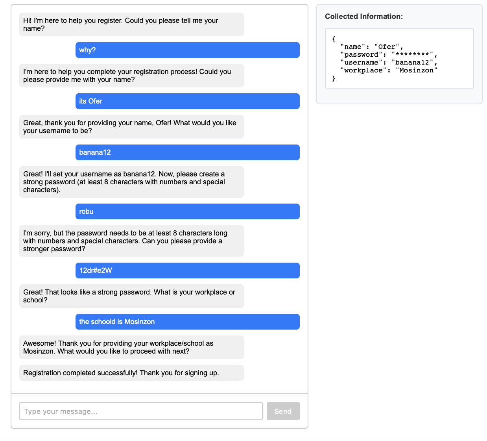

# AI Web Server

A simple web server with a centered text input interface built using Flask.



## Prerequisites

- Python 3.11 or higher
- Git

## Setup Instructions

1. Clone the repository
```bash
git clone <repository-url>
cd ai-web-server
```

2. Install uv (if not already installed)
```bash
pip install uv
```

3. Create a virtual environment
```bash
uv venv
```

4. Activate the virtual environment
```bash
# MacOS
source .venv\scripts\activate

# Windows:
.venv\Scripts\activate
```

5. Install dependencies
```bash
uv pip install -e .
```

6. Run the server
```bash
uv run -m ai_web_server.app
```

## Accessing the Application

Once the server is running, open your web browser and navigate to `http://127.0.0.1:5000`
